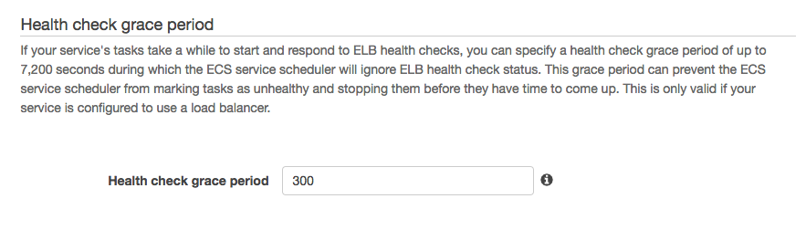

# fargate-java-sample

By Using AWS Fargate, ECS, and ECR to demonstrate how to leverage Serveless containers to run Java Spring application.


## Insturction Steps

1. Make sure that Docker is installed on your laptop or environment which you like.
2. Integrate GoogleContainerTools/jib into your maven project
```
<plugin>
                <groupId>com.google.cloud.tools</groupId>
                <artifactId>jib-maven-plugin</artifactId>
                <version>0.9.10</version>
                <configuration>
                    <to>
                        <image>"aws-account-id".dkr.ecr.ap-northeast-1.amazonaws.com/"repo-name"</image>
                        <credHelper>ecr-login</credHelper>
                    </to>
                </configuration>
            </plugin>
```
3. Install amazon-ecr-credential-helper - https://github.com/awslabs/amazon-ecr-credential-helper
4. put the docker-credential-ecr-login into $PATH
5. Create a docker repository on AWS ECR
```
aws ecr create-repository --repository-name fargate/spring-petclinic
```
6. build and test locally without any error
```
mvn clean test build
```
7. build and push a docker image to ECR
```
mvn compile jib:build
```
8. add the jib build in the maven build lifecycle
You can also bind jib:build to a Maven lifecycle, such as package, by adding the following execution to your jib-maven-plugin definition:
```
<plugin>
  <groupId>com.google.com.tools</groupId>
  <artifactId>jib-maven-plugin</artifactId>
  ...
  <executions>
    <execution>
      <phase>package</phase>
      <goals>
        <goal>build</goal>
      </goals>
    </execution>
  </executions>
</plugin>
```
Then, you can run this command : 
```
mvn package
```

Check for the running result:
```
[INFO] --- jib-maven-plugin:0.9.10:build (default) @ spring-petclinic ---
[WARNING] Base image 'gcr.io/distroless/java' does not use a specific image digest - build may not be reproducible
[INFO] 
[INFO] Containerizing application to aws-account-id.dkr.ecr.ap-northeast-1.amazonaws.com/fargate/spring-petclinic...
[INFO] 
[INFO] Retrieving registry credentials for aws-account-id.dkr.ecr.ap-northeast-1.amazonaws.com...
[INFO] Getting base image gcr.io/distroless/java...
[INFO] Building dependencies layer...
[INFO] Building resources layer...
[INFO] Building classes layer...
[INFO] Finalizing...
[INFO] 
[INFO] Container entrypoint set to [java, -cp, /app/resources/:/app/classes/:/app/libs/*, org.springframework.samples.petclinic.PetClinicApplication]
[INFO] 
[INFO] Built and pushed image as "Your-AWS-Account-ID".dkr.ecr.ap-northeast-1.amazonaws.com/"Your-ECR-Image"
[INFO] 
[INFO] ------------------------------------------------------------------------
[INFO] BUILD SUCCESS
[INFO] ------------------------------------------------------------------------
[INFO] Total time: 39.797 s
[INFO] Finished at: 2018-09-10T12:14:59+08:00
[INFO] ------------------------------------------------------------------------

```
9. Install AWS Fargate CLI to simplify the instruction - http://somanymachines.com/fargate/
You can choose download the binary directly, or manual build it ony your laptop leverage the source : https://github.com/jpignata/fargate

10. Until 2018-09-14, the Fargate CLI doesn't support multiple region usage, you need to clone the source code to make build yourself, take a look from here:
https://twitter.com/pahudnet/status/1040233349141295104

```
change directory to $GOPATH, wich contains 3 folders make you easy to check.

# ex: /Users/aaa/go --> $GOPATH
#/Users/aaa/go/bin
#/Users/aaa/go/pkg
#/Users/aaa/go/src

# git clone the fargate cli into the $GOPATH/src folder
cd /Users/aaa/go/src
git clone https://github.com/jpignata/fargate.git

cd /Users/aaa/go/src/fargate
rm Gopkg.lock
dep ensure -v
make build

#Once the make build process finish, you can copy the build bin file --> fargate to $GOROOT/bin

cp bin/fargate /Users/aaa/go/bin/
```

11. Create ECS Service in Fargate Mode

```
fargate service create <service name> [--cpu <cpu units>] [--memory <MiB>] [--port <port-expression>]
                                      [--lb <load-balancer-name>] [--rule <rule-expression>]
                                      [--image <docker-image>] [--env <key=value>] [--num <count>]
                                      [--task-role <task-role>] [--subnet-id <subnet-id>]
                                      [--security-group-id <security-group-id>]
```
More detail instructions are available at: 

https://github.com/jpignata/fargate

There several ways to run ecs services in fargate mode, if you would like to have the ability to do Blue/Green deployment strategy, that would be great to run ecs service behind the ALB(Application Load Balancer). Not only for the intent, imagine that you you have a lot of microservices and need to well-manage for service discovery, it's also the key to run behind the ALB. 

12. Create ALB from fargate cli
```
fargate lb create <load-balancer-name> --port <port-expression> [--certificate <certificate-name>]
                                       [--subnet-id <subnet-id>] [--security-group-id <security-group-id>]
```

For the LoadBalancer limitation, you need to specify at least 2 subnets to provision the ALB
```

#for example ~ 
fargate lb create kim-alb --port HTTP:80 \
    --subnet-id subnet-074e51c30471cab75 \
    --subnet-id subnet-085bf83625bd113cc \
    --subnet-id subnet-0bbdba02d35e95a4b \
    --security-group-id sg-0702741778429f7f3 \
    --region ap-northeast-1 
```

13. Create ECS Service with ALB

```
fargate service create <service name> [--cpu <cpu units>] [--memory <MiB>] [--port <port-expression>]
                                      [--lb <load-balancer-name>] [--rule <rule-expression>]
                                      [--image <docker-image>] [--env <key=value>] [--num <count>]
                                      [--task-role <task-role>] [--subnet-id <subnet-id>]
                                      [--security-group-id <security-group-id>]
                                      

#for example ~ 
fargate service create spring-petclinic \
    --region ap-northeast-1 --verbose \
    --port HTTP:8080 --lb kim-alb --num 3 \
    --image aws-account-id.dkr.ecr.ap-northeast-1.amazonaws.com/fargate/spring-petclinic \
    --subnet-id subnet-074e51c30471cab75 \
    --subnet-id subnet-085bf83625bd113cc \
    --subnet-id subnet-0bbdba02d35e95a4b \
    --security-group-id sg-0702741778429f7f3
                                      
```

# Java Spring framework Application Lifecycle in ECS-Fargate

Considering ELB health check mechanism, if the application starting time period is higher than the ELB health check retry timeout...
Then you will find that all the ECS Service/Tasks are always unhealthy and draining.


    
# ECS Service Discovery integration with Route53

As the growing microservices amount, you may get stucked at where can i register/find the services, service discoverying become the new normal question. By using AWS Route53, This makes it possible for an ECS service to automatically register itself with a predictable and friendly DNS name in Amazon Route 53. As your services scale up or down in response to load or container health, the Route 53 hosted zone is kept up to date, allowing other services to lookup where they need to make connections based on the state of each service.  

1. Create the Service Discovery Namespace and Service 
```
aws servicediscovery create-private-dns-namespace --name petclinic --vpc vpc-05999b5a8a59abeb4 --region ap-northeast-1
```
once running the command, aws servicediscovery create dns namespace in async, you could inquiery the ceation status by the out operationID as below: 

```
{
    "OperationId": "qo3huxxxxxxxxx"
}
```

```
aws servicediscovery get-operation --operation-id qo3huizt6dw7mhi542dok2uyegkzfj6a-jme5usaw
```

Check it runs well. get the success status and namespace ID. 
```
{
    "Operation": {
        "Id": "qo3huizt6dw7mhi542dok2uyegkzfj6a-jme5usaw",
        "Type": "CREATE_NAMESPACE",
        "Status": "SUCCESS",
        "CreateDate": 1537664690.12,
        "UpdateDate": 1537664691.456,
        "Targets": {
            "NAMESPACE": "ns-fvs7tewkdvv5smry"
        }
    }
}
```
Then, we could leverage the namespace to create service in the namespace. In the example we created a A record in DNS records.

2. Create Service in NameSpace

```
aws servicediscovery create-service --name petclinic \
    --dns-config 'NamespaceId="ns-fvs7tewkdvv5smry",DnsRecords=[{Type="A",TTL="300"}]' \
    --health-check-custom-config FailureThreshold=1 --region ap-northeast-1
```
output, make sure the service registration is done.
```
{
    "Service": {
        "Id": "srv-ulqpebqbp6fsgopn",
        "Arn": "arn:aws:servicediscovery:ap-northeast-1:aws-account-id:service/srv-ulqpebqbp6fsgopn",
        "Name": "petclinic",
        "DnsConfig": {
            "NamespaceId": "ns-fvs7tewkdvv5smry",
            "RoutingPolicy": "MULTIVALUE",
            "DnsRecords": [
                {
                    "Type": "A",
                    "TTL": 300
                }
            ]
        },
        "HealthCheckCustomConfig": {
            "FailureThreshold": 1
        },
        "CreatorRequestId": "9804b5ab-c0cd-4e94-8afd-246be188126a"
    }
}
``` 


3. Register spring-petClinic running services into Route53. Prepare the file - ecs-service-discovery.json whcih explains the detail structure.
```
{
    "cluster": "fargate",
    "serviceName": "ecs-service-discovery",
    "taskDefinition": "service_spring-petclinic",
    "serviceRegistries": [
       {
          "registryArn": "arn:aws:servicediscovery:ap-northeast-1:584518143473:service/srv-ulqpebqbp6fsgopn"
       }
    ],
    "launchType": "FARGATE",
    "platformVersion": "1.2.0",
    "networkConfiguration": {
       "awsvpcConfiguration": {
          "assignPublicIp": "ENABLED",
          "securityGroups": [ "sg-0702741778429f7f3" ],
          "subnets": [ "subnet-074e51c30471cab75","subnet-085bf83625bd113cc","subnet-0bbdba02d35e95a4b" ]
       }
    },
    "desiredCount": 1
}
```

Create your ECS service, specifying the Fargate launch type and the 1.2.0(latest version until 2018-09-23) platform version, which uses service discovery.
```
aws ecs create-service --cli-input-json file://ecs-service-discovery.json --region ap-northeast-1
```
We got a long output, contains the registration and ecs task information
```
{
    "service": {
        "serviceArn": "arn:aws:ecs:ap-northeast-1:584518143473:service/ecs-service-discovery",
        "serviceName": "ecs-service-discovery",
        "clusterArn": "arn:aws:ecs:ap-northeast-1:584518143473:cluster/fargate",
        "loadBalancers": [],
        "serviceRegistries": [
            {
                "registryArn": "arn:aws:servicediscovery:ap-northeast-1:584518143473:service/srv-ulqpebqbp6fsgopn"
            }
        ],
        "status": "ACTIVE",
        "desiredCount": 1,
        "runningCount": 0,
        "pendingCount": 0,
        "launchType": "FARGATE",
        "platformVersion": "1.2.0",
        "taskDefinition": "arn:aws:ecs:ap-northeast-1:584518143473:task-definition/service_spring-petclinic:6",
        "deploymentConfiguration": {
            "maximumPercent": 200,
            "minimumHealthyPercent": 100
        },
        "deployments": [
            {
                "id": "ecs-svc/9223370499187978771",
                "status": "PRIMARY",
                "taskDefinition": "arn:aws:ecs:ap-northeast-1:584518143473:task-definition/service_spring-petclinic:6",
                "desiredCount": 1,
                "pendingCount": 0,
                "runningCount": 0,
                "createdAt": 1537666797.036,
                "updatedAt": 1537666797.036,
                "launchType": "FARGATE",
                "platformVersion": "1.2.0",
                "networkConfiguration": {
                    "awsvpcConfiguration": {
                        "subnets": [
                            "subnet-085bf83625bd113cc",
                            "subnet-074e51c30471cab75",
                            "subnet-0bbdba02d35e95a4b"
                        ],
                        "securityGroups": [
                            "sg-0702741778429f7f3"
                        ],
                        "assignPublicIp": "ENABLED"
                    }
                }
            }
        ],
        "roleArn": "arn:aws:iam::584518143473:role/aws-service-role/ecs.amazonaws.com/AWSServiceRoleForECS",
        "events": [],
        "createdAt": 1537666797.036,
        "placementConstraints": [],
        "placementStrategy": [],
        "networkConfiguration": {
            "awsvpcConfiguration": {
                "subnets": [
                    "subnet-085bf83625bd113cc",
                    "subnet-074e51c30471cab75",
                    "subnet-0bbdba02d35e95a4b"
                ],
                "securityGroups": [
                    "sg-0702741778429f7f3"
                ],
                "assignPublicIp": "ENABLED"
            }
        },
        "schedulingStrategy": "REPLICA"
    }
}
```
check for the runtime instance:
```
aws servicediscovery list-instances --service-id srv-ulqpebqbp6fsgopn --region ap-northeast-1
```
Output:

```
{
    "Instances": [
        {
            "Id": "9d8db77a-919a-4644-80f0-bda078670e62",
            "Attributes": {
                "AWS_INSTANCE_IPV4": "10.0.1.107"
            }
        }
    ]
}
```

Now, we can check for the running service is registered in the Route53 Name service or not.
The DNS records created in the Route 53 hosted zone for the service discovery service can be queried with the following CLI commands.

First, using the namespace ID, get information about the namespace, which includes the Route 53 hosted zone ID:

```
aws servicediscovery get-namespace --id ns-fvs7tewkdvv5smry --region ap-northeast-1
```
Output:
```
{
    "Namespace": {
        "Id": "ns-fvs7tewkdvv5smry",
        "Arn": "arn:aws:servicediscovery:ap-northeast-1:584518143473:namespace/ns-fvs7tewkdvv5smry",
        "Name": "petclinic",
        "Type": "DNS_PRIVATE",
        "Properties": {
            "DnsProperties": {
                "HostedZoneId": "ZRG3KSU0HSE3S"
            }
        },
        "CreateDate": 1537664691.435,
        "CreatorRequestId": "18181c29-ded0-48a6-82bd-02a96d02bb8f"
    }
}
```
Then, using the Route 53 hosted zone ID, get the resource record set for the hosted zone:

```
aws route53 list-resource-record-sets --hosted-zone-id ZRG3KSU0HSE3S --region ap-northeast-1
```
Output:
```
{
    "ResourceRecordSets": [
        {
            "Name": "petclinic.",
            "Type": "NS",
            "TTL": 172800,
            "ResourceRecords": [
                {
                    "Value": "ns-1536.awsdns-00.co.uk."
                },
                {
                    "Value": "ns-0.awsdns-00.com."
                },
                {
                    "Value": "ns-1024.awsdns-00.org."
                },
                {
                    "Value": "ns-512.awsdns-00.net."
                }
            ]
        },
        {
            "Name": "petclinic.",
            "Type": "SOA",
            "TTL": 900,
            "ResourceRecords": [
                {
                    "Value": "ns-1536.awsdns-00.co.uk. awsdns-hostmaster.amazon.com. 1 7200 900 1209600 86400"
                }
            ]
        },
        {
            "Name": "petclinic.petclinic.",
            "Type": "A",
            "SetIdentifier": "9d8db77a-919a-4644-80f0-bda078670e62",
            "MultiValueAnswer": true,
            "TTL": 300,
            "ResourceRecords": [
                {
                    "Value": "10.0.1.107"
                }
            ],
            "HealthCheckId": "5b24529a-8c26-4d70-8eda-d9a7c0196a55"
        }
    ]
}
```
Now, please provision an ec2 in your vpc which contains the ecs services, we would leverage the ec2 instance to run a dig command to get real ip inside the vpc.

You can also query the DNS using dig from an instance within your VPC with the following command:

```
dig +short petclinic.petclinic.
```

# ECS De-registration from Route53 Service Discovery Service
if you want to remove the registration, justy follow the commands, please beware that the service discovery service is only allowed by the command line access, you can not modify the detail settings via console.
Once you try to do with console, you will get an alert that you don't have the permission to modify but allowed by servicediscoveryxxxxxx message.

##Clean up

1. deregister
```
aws servicediscovery deregister-instance --service-id srv-ulqpebqbp6fsgopn --instance-id 9d8db77a-919a-4644-80f0-bda078670e62 --region ap-northeast-1
```
output.
```
{
    "OperationId": "eo5m3chy4akdzx5jpkqfijoy5jrix2ah-jmea794z"
}
```

2. check for the drregister operation
```
aws servicediscovery get-operation --operation-id eo5m3chy4akdzx5jpkqfijoy5jrix2ah-jmea794z --region ap-northeast-1
```
output.
```
{
    "Operation": {
        "Id": "eo5m3chy4akdzx5jpkqfijoy5jrix2ah-jmea794z",
        "Type": "DEREGISTER_INSTANCE",
        "Status": "SUCCESS",
        "CreateDate": 1537671990.275,
        "UpdateDate": 1537671993.905,
        "Targets": {
            "INSTANCE": "9d8db77a-919a-4644-80f0-bda078670e62",
            "ROUTE_53_CHANGE_ID": "C149UB850NBAKP",
            "SERVICE": "srv-ulqpebqbp6fsgopn"
        }
    }
}
```

3. delete service discovery service
```
aws servicediscovery delete-service --id srv-ulqpebqbp6fsgopn --region ap-northeast-1
```

4. delete service discovery namespace
```
aws servicediscovery delete-namespace --id ns-fvs7tewkdvv5smry --region ap-northeast-1
```
output.

```
{
    "OperationId": "qo3huizt6dw7mhi542dok2uyegkzfj6a-jmeacu8d"
}
```

update ecs services to 0 

```
aws ecs update-service --cluster fargate --service ecs-service-discovery --desired-count 0 --force-new-deployment --region ap-northeast-1
```
delete the service
```
aws ecs delete-service --cluster fargate --service ecs-service-discovery --region ap-northeast-1
```


# TODO

* Add the one-click cloudformation execution to create vpc (optional usage if you don't have)
* Add the architecture diagram to illustrate ecs/fargate java application serve behind ALB
* Add the Blue/Green Deployment instruction with CodePipeline
